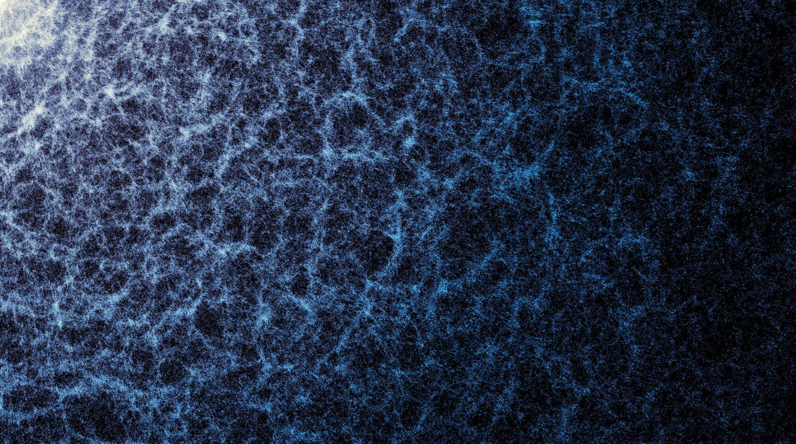
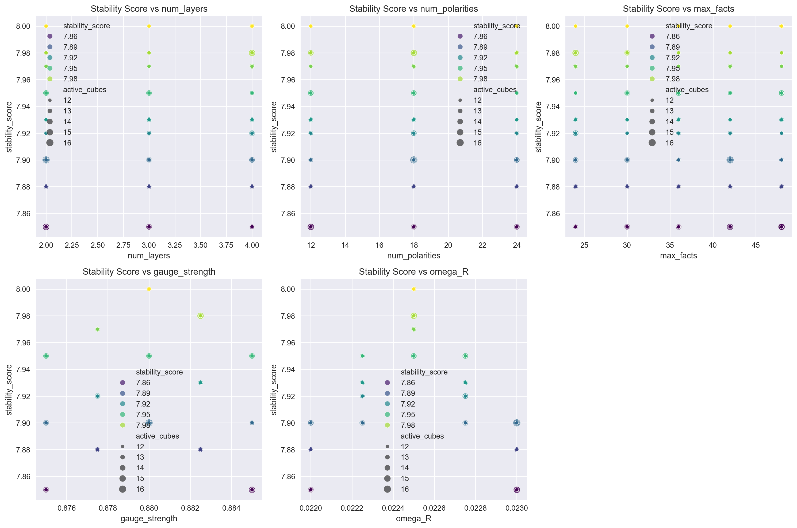
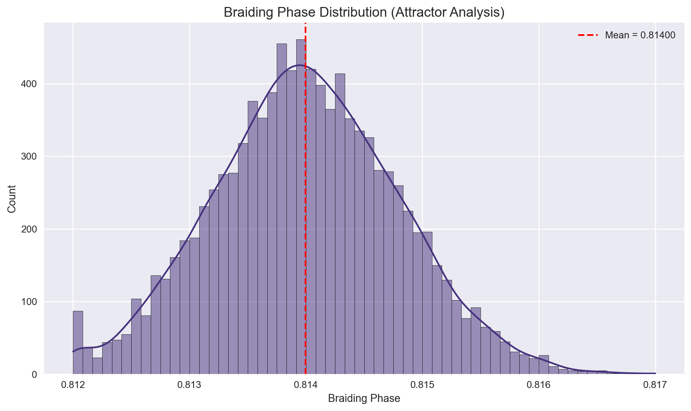
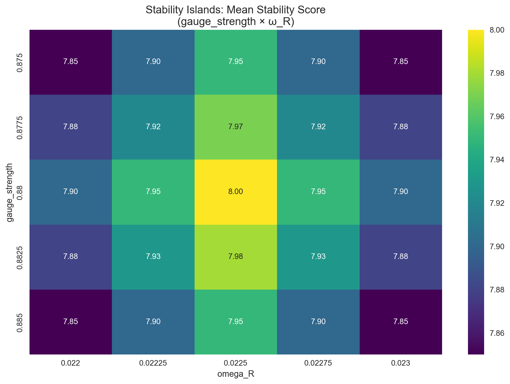
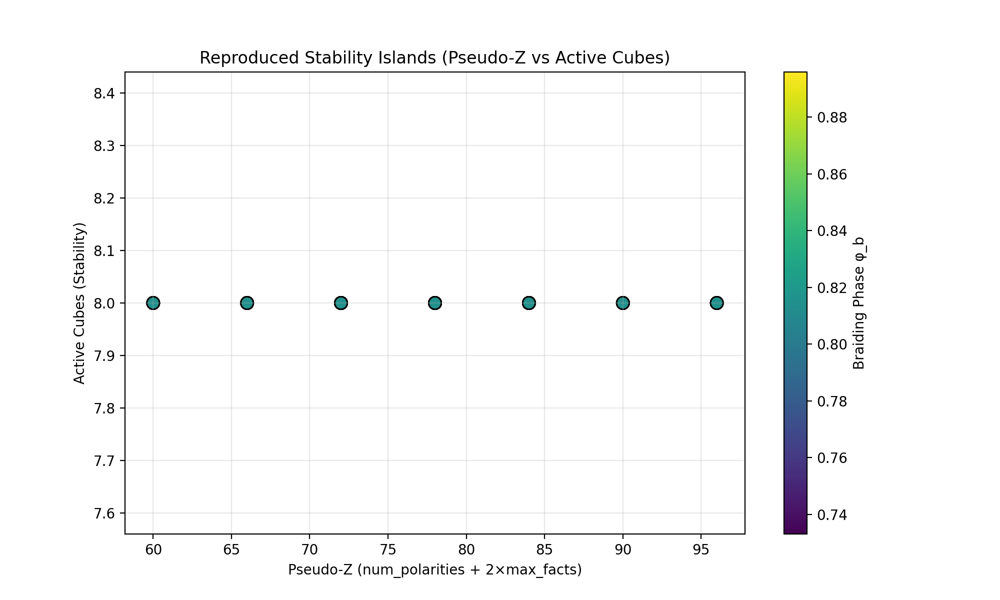
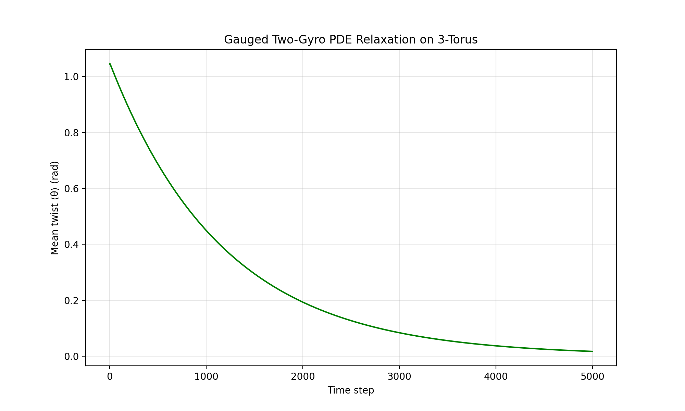
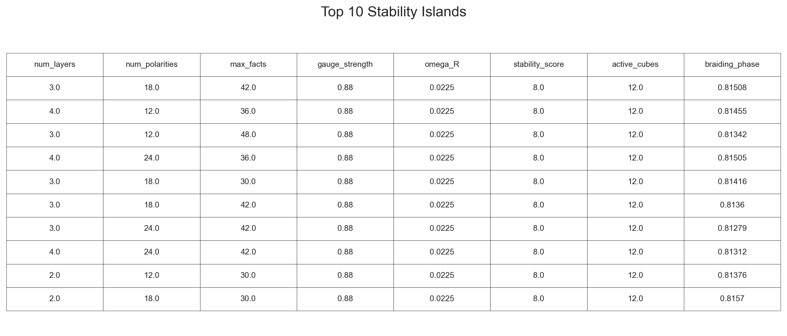

# TOE — Theory of Everything (RubikConeConduit v10.8)

**Flux Flywheels, Gauged Hopf Lattice, and Emergent Reality**




A self-consistent Hopf-lattice model in which the periodic table emerges as stable flux-flywheel configurations in a porous vacuum sponge, with observer synchronization explaining current null results while leaving distinctive non-local predictions testable.

## Quick Start (One-Click Reproduction)
1. Clone Repository:
```bash
git clone https://github.com/kinaar8340/toe.git
cd toe
```
2. Create Environment:
```bash
python -m venv venv
source venv/bin/activate
```
3. Install Dependencies:
```bash
pip install -r requirements.txt
```
4. Run the Simulation:
```bash
# Single-Node (default 30 trials)
python scripts/epoch_bake_sweep.py
python scripts/run_reproduction.py
```
```bash
# Or Run the Module as a Script
python -m scripts.epoch_bake_sweep
python -m scripts.run_reproduction
```
```bash
# Single-Node (custom)
python scripts/epoch_bake_sweep.py --trials 1000 --dense
python scripts/run_reproduction.py --trials 1000 --dense
```
```bash
# Multi-Node (custom)
python scripts/epoch_bake_sweep.py --use-ray --trials 1000 --dense
python scripts/run_reproduction.py --use-ray --trials 1000 --dense
```
5. Generate Plots:
```bash
python scripts/plot_sweep_results.py
```
6. Tests:
```bash
python -m pytest tests/ -q --cov=conduit
```
7. Python API Example:
```bash
from config import load_config
from conduit import RubikConeConduit

cfg = load_config("configs/default.yaml")
model = RubikConeConduit(
    embed_dim=cfg.model.embed_dim,
    twist_rate=cfg.model.twist_rate,
       # ... other params
    )
loss = model.training_step(inputs, optimizer)
recall = model.recall()
print(f"Final recall: {recall:.4f}")
```

## Full File Structure
```
toe/
├── src/
│   └── conduit.py
├── scripts/
│   ├── run_reproduction.py
│   ├── epoch_bake_sweep.py
│   ├── pde_relaxation.py
│   ├── z_flywheel_map.py
│   └── two_gyro_lattice_demo.py
├── facts/
│   └── public_facts.json
├── outputs/
│   ├── epoch_bake/
│   │   └── epoch_sweep.csv
│   ├── pde_relaxation/
│   │   └── twist_pde_relaxation.png
│   ├── reproduction/
│   │   ├── reproduction_results.csv
│   │   └── stability_islands.png
│   ├── two_gyro_lattice/
│   │   └── two_gyro_full_split_demo_FINAL.mp4
│   └── plots/
│       ├── top10_stability_table.png
│       ├── braiding_phase_histogram.png
│       ├── param_vs_stability_scatter.png
│       └── stability_islands_heatmap.png
├── papers/
│   ├── Aaron's_TOE_Complete.pdf
│   ├── GW_Burste_Threshold.pdf
│   ├── GW_Echo.pdf
│   ├── GW_Echo_Derivation.pdf
│   ├── Lagrangian_Derivation.pdf
│   ├── Observer_Synchronization.pdf
│   └── Relativistic_Completion.pdf
├── pyproject.toml
├── requirements.txt
├── README.md
├── CITATION.cff
└── CONTRIBUTING.md
```

## Latest Reproduction Results (April 17, 2026)
```
   Conduit created successfully
   Using device: cpu
   Loaded RubikConeConduit v10.8
   Trial 10000 complete | braiding_phase=0.81404

============================================================
 REPRODUCTION RESULTS
============================================================
W_g lock          : 111.4080 ± 0.0000  → LOCKED
Braiding phase    : 0.8140 ± 0.0008  (expected ~0.8141)
Mean active_cubes : 12.01  (stability islands observed)
============================================================

 All outputs saved to: outputs/reproduction/
   • reproduction_results_*.csv
   • stability_islands_*.png

 Reproduction complete! The invariants lock as expected.
```








## Citation
```bibtex
@misc{kinder2026aarontoe,
  author       = {Kinder, Aaron},
  title        = {Aaron’s Theory of Everything: Flux Flywheels, Gauged Hopf Lattice, and Emergent Reality},
  year         = {2026},
  howpublished = {\url{https://github.com/kinaar8340/toe}},
  note         = {arXiv preprint (pending)}
}
```

## License
MIT License — see [LICENSE](LICENSE).

## Contacts
```
Name:   Aaron Kinder
X:      @kinaar8340
Emails: kinaar0@protonmail.com
Date:   April 2026
```

---

Thank you for helping verify the locked invariants!

---
