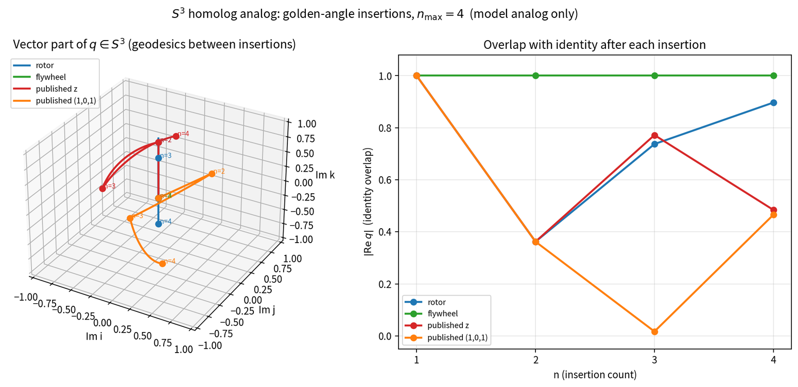
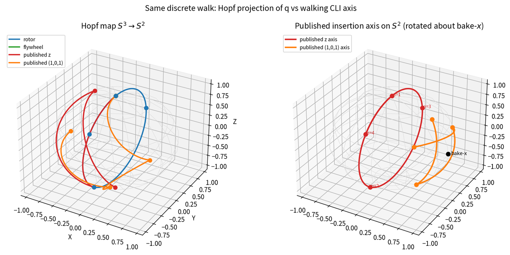
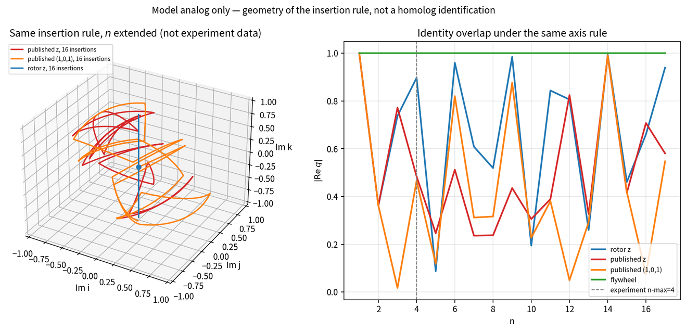

# \(S^3\) insertion walks (model analog)

```
MODEL, not theorem.
Geometry and arithmetic stay on QGA / flux_hopf_lib.
The alkane / CH2 / carbene language is an analogy for a discrete insertion step.
n=1 is one flywheel at quaternion identity (methane slot).
n=2 is one extra published step: one extra flywheel XOR one extra rotor insertion.
Do not emit “proves”, “element”, “periodic table identity”, or “carbene is a flywheel”.
```

The three insertion walks on \(S^3\), plotted with geodesic segments between the discrete steps. analog: geometry of the insertion rule, not a homolog identification.

The four stations of the homolog analog live in \(S^3\subset\mathbb{R}^4\). The plots below use the same left-multiply composition as the table: identity seed \(q=(1,0,0,0)\), golden-angle step \(\theta\approx 2.399963\), bake-\(x=(1,0,0)\). Segments between \(n=1\ldots4\) are spherical geodesics (slerp), not extra insertions.

**Vector part of \(q\).**
A unit quaternion is \(q=(\mathrm{Re}\,q,\mathrm{Im}\,q)\). Identity is the origin of the \(\mathrm{Im}\) plot; radius \(\lvert\mathrm{Im}\,q\rvert=\sqrt{1-(\mathrm{Re}\,q)^2}\). Rotor stays in the \(ik\)-plane (fixed \(z\)-axis). Flywheel never leaves the origin. Published leaves that plane as soon as the axis walks.



The right panel is the table: rotor follows \(\lvert\cos((n-1)\theta/2)\rvert\); published shares \(n=2\) then splits; flywheel is the constant \(1\).

**Hopf projection of \(q\), and the published axis on \(S^2\).**
The Hopf map \(S^3\to S^2\) collapses each fiber to a point. Rotor and flywheel sit on short, simple traces there. The published CLI axis itself is a separate \(S^2\) walk: default \(z\) stays in the \(yz\)-circle of length \(\theta\); \((1,0,1)/\sqrt{2}\) is the shorter chord \(\arccos(\cos^2(\theta/2))\approx 1.439\) and grows an \(x\)-component.



**Same rule past the experiment cut.**
Extending \(n\) does not add data; it only shows what the generator does. Rotor is a single great circle on \(S^3\) (periodic in \(\lvert\mathrm{Re}\,q\rvert\)). Published is a broken geodesic whose plane changes by \(R_x(\theta)\) each step. The dashed line is \(n_{\max}=4\).



Off-yz published almost hits the \(S^3\) equator at \(n=3\) (\(\lvert\mathrm{Re}\,q\rvert\approx 0.017\)), then returns to \(0.466\) at \(n=4\). That is a location on the walk, not a locked invariant and not a homolog identification. Aliases, \(Z\), and the periodic table are not in these figures.
